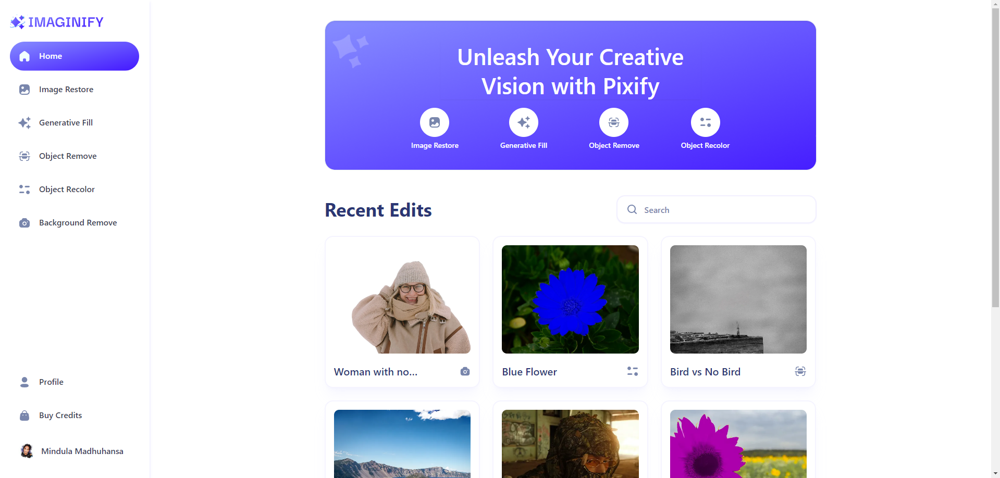
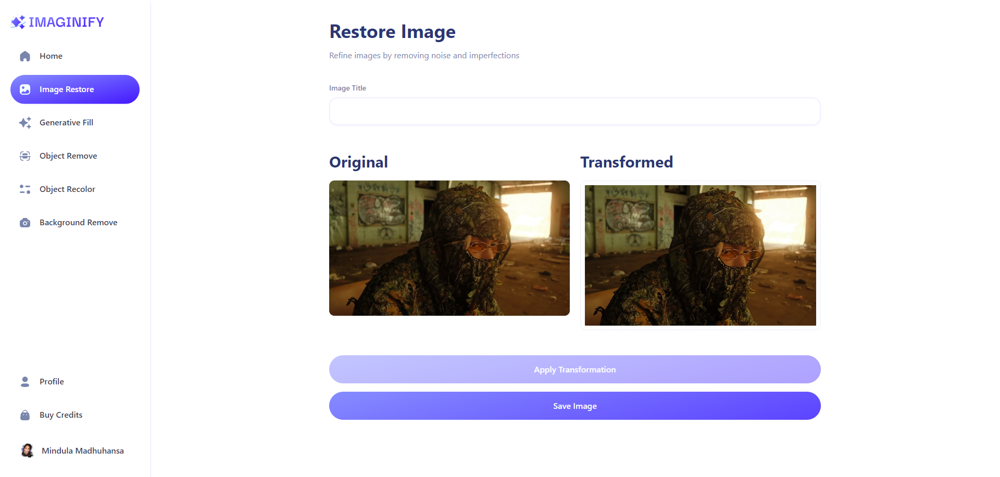
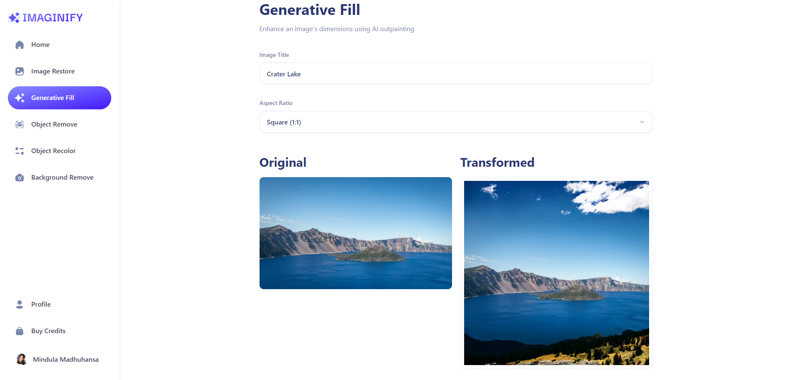
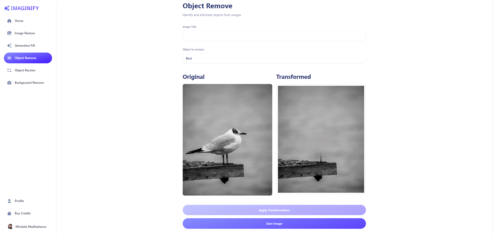
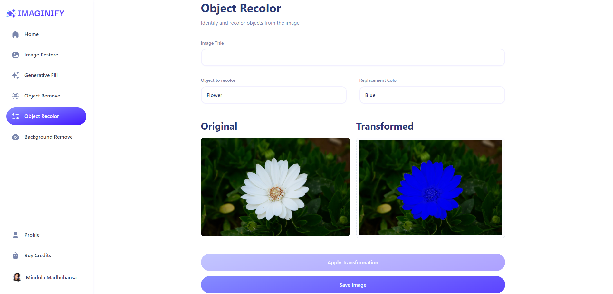
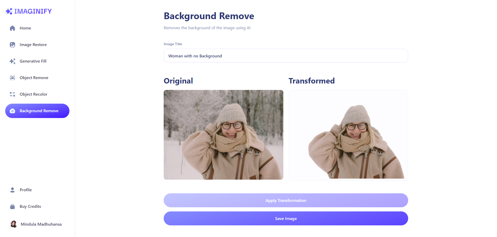
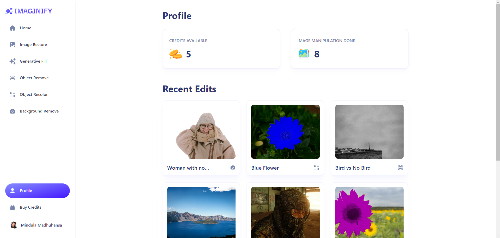
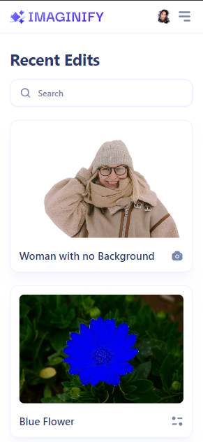
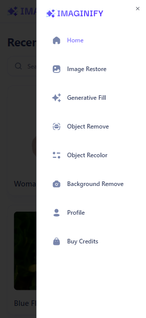

# ✨ Pixify

AI-Powered image editor!

## 🚀 Getting Started

1. Clone the project
2. Run `npm install` in the terminal to install all dependencies for your project.
3. Create a `.env.local` file in the root directory.
4. Add your keys as in the `.env.example` file.
5. Finally, run `npm run dev` in your terminal to start the server.

## ⚙️ Tech Stack

1. React
2. Next.js 14
3. Clerk
4. Stripe
5. Cloudinary AI
6. Tailwind CSS

## 📸 Screenshots

### 🏠 Home

### 🤖 Features

### 🙍🏼‍♂️🙍🏼‍♀️ Profile

### 🪙 Credits

### 📱 Mobile

